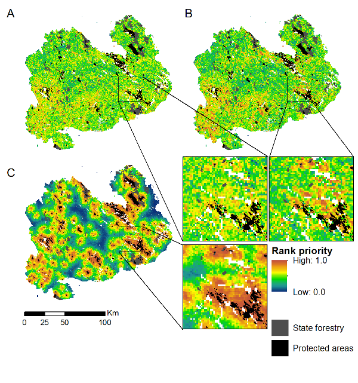

## Figure 2 
### Priority rank maps for analysis variants (all 4).
     
1. Selected variants are 16, 17, 18, 20  

1. Created a new folder validity_ms\figs\maps to contain ArcMap-specifc map 
files  

1. Created validity_ms\figs\maps\Figure2.mxd  

1. IF the whole province (ESMK) is shown, the maps look very alike because of 
the resolution. At least two options to fix this:  
  * Aggregate (with mean) to a coarser resolution (e.g. 600x600m)
  * Zoom in for a closer look

1. Paths to figure pabels A-D (runs 16, 17, 18 and 20) changed to point to the
new (local) runs that correspond to the August runs. **NOTE** that these are not
the final, corrected runs.

1. All 4 variants aggregated to 600x600 meters and placed in the respective 
output folders.

  ```
  arcpy.Aggregate_sa("result_16_60_abf_pe_w", "G:/Data/Metsakeskukset/Etela-Savo/Zonation/Results/130315/analyysi/16_60_5kp_abf_pe_w/output/result_16_600_5kp_abf_pe_w.rank.compressed.img", "10", "MEAN", "EXPAND", "DATA")
  ```
  
  ```
  arcpy.Aggregate_sa("result_17_60_abf_pe_w_cmat", "G:/Data/Metsakeskukset/Etela-Savo/Zonation/Results/130315/analyysi/17_60_5kp_abf_pe_w_cmat/output/result_17_600_5kp_abf_pe_w_cmat.rank.compressed.img", "10", "MEAN", "EXPAND", "DATA")
  ```
  
  ```
  arcpy.Aggregate_sa("result_18_60_5kp_abf_pe_w_cmat_cmete", "G:/Data/Metsakeskukset/Etela-Savo/Zonation/Results/130315/analyysi/18_60_5kp_abf_pe_w_cmat_cmete/output/result_18_600_5kp_abf_pe_w_cmat_cmete.rank.compressed.img", "10", "MEAN", "EXPAND", "DATA")
  ```
  
  ```
  arcpy.Aggregate_sa("result_20_60_5kp_abf_pe_w_cmat_cmete_cres_mask", "G:/Data/Metsakeskukset/Etela-Savo/Zonation/Results/130315/analyysi/20_60_5kp_abf_pe_w_cmat_cmete_cres_mask/output/result_20_600_5kp_abf_pe_w_cmat_cmete_cres_mask.rank.compressed.img", "10", "MEAN", "EXPAND", "DATA")
  ```
  
### Meeting with Atte 2013-04-05

Changes proposed to the figure:
* Without condition layer ([~~issue #1~~](https://github.com/jlehtoma/validityms/issues/1))
* 3 panels with contrast ([issue #2](https://github.com/jlehtoma/validityms/issues/2))
* Maybe an insert of close-up ([issue #3](https://github.com/jlehtoma/validityms/issues/3))

1. Included variants changed, variant 1 (14) introduced: needs to be aggregated as well.

  ```
  arcpy.Aggregate_sa("result_14_60_5kp_abf.rank.compressed.img", "G:/Data/Metsakeskukset/Etela-Savo/Zonation/Results/130315/analyysi/14_60_5kp_abf/output/result_14_600_5kp_abf.rank.compressed.img", "10", "MEAN" ,"EXPAND", "DATA")
  ```

----
### Latest version:


