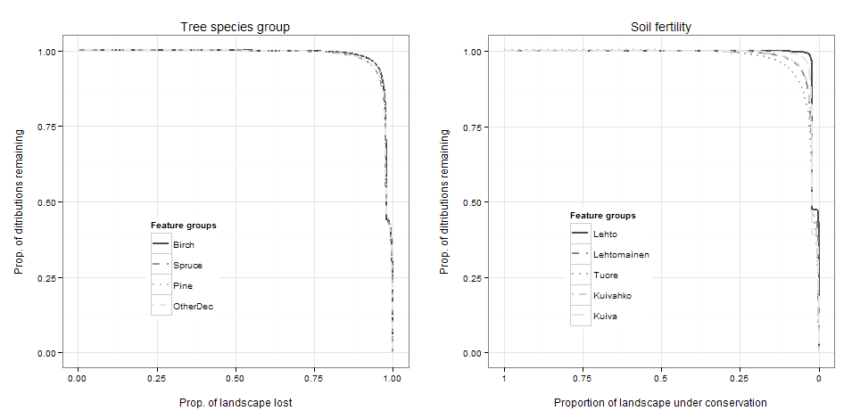
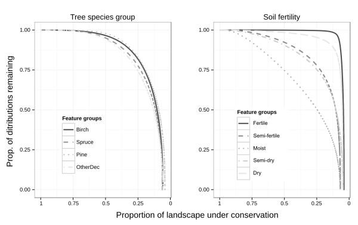

## Figure 3 
### Representation levels of feature groups (grouped by spp or fertility) for frx and others

### Meeting with Atte 2013-04-05

Changes proposed to the figure:
* Add 2 more panels with PAs masked-in versions ([issue #4](https://github.com/jlehtoma/validityms/issues/4))

However, Using variant 20 won't do, because it has (rather strong) interaction connectivity component turned on

.

----
### Latest version:

