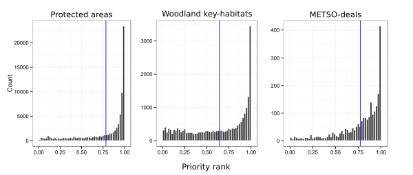

## Figure 4
### Distributions of priority ranks (histograms) in different, independent data sets.

### 2013-04-05 Meeting with Atte 

Changes proposed to the figure:
* Add 3 more panels so that all variants are covered ([~~issue #5~~](https://github.com/jlehtoma/validityms/issues/5))

### 2013-04-11

* All 4 variants added to the figure. 4th column also includes histograms for 
engo-sites.

----
### Latest version:

