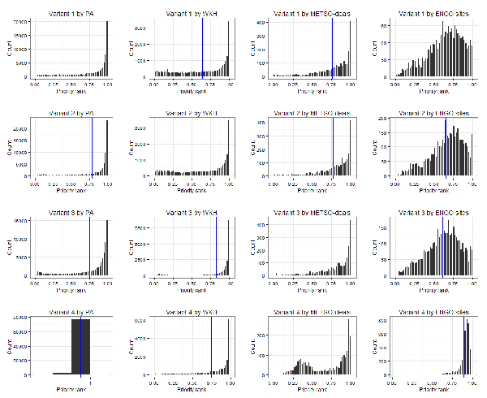

## Figure 4
### Distributions of priority ranks (histograms) in different, independent data sets.

### Meeting with Atte 2013-04-05

Changes proposed to the figure:
* Add 3 more panels so that all variants are covered ([issue #5](https://github.com/jlehtoma/validityms/issues/5))

----
### Latest version:

