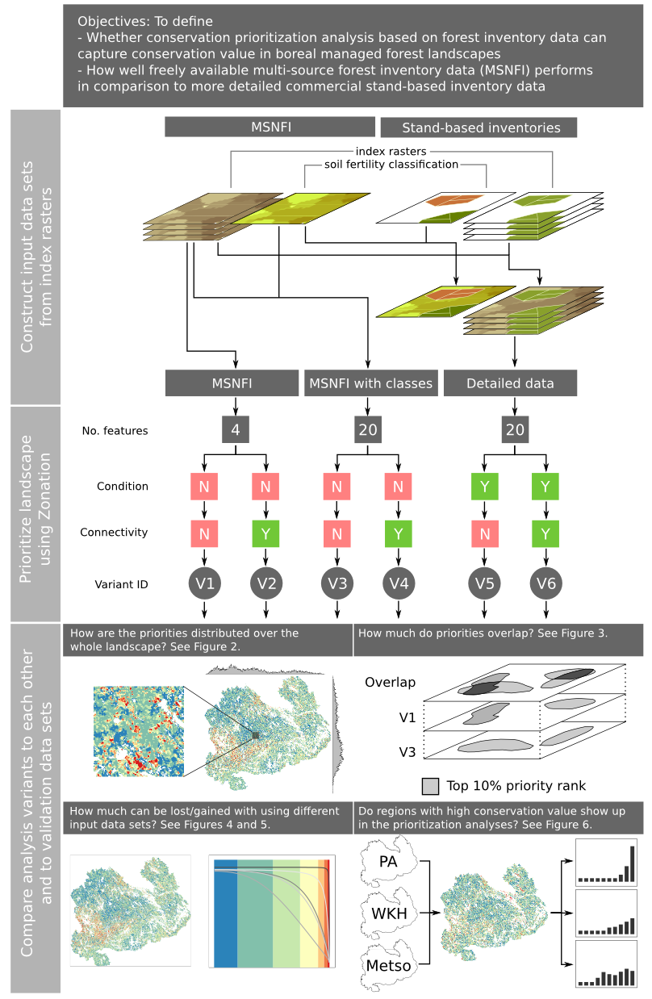
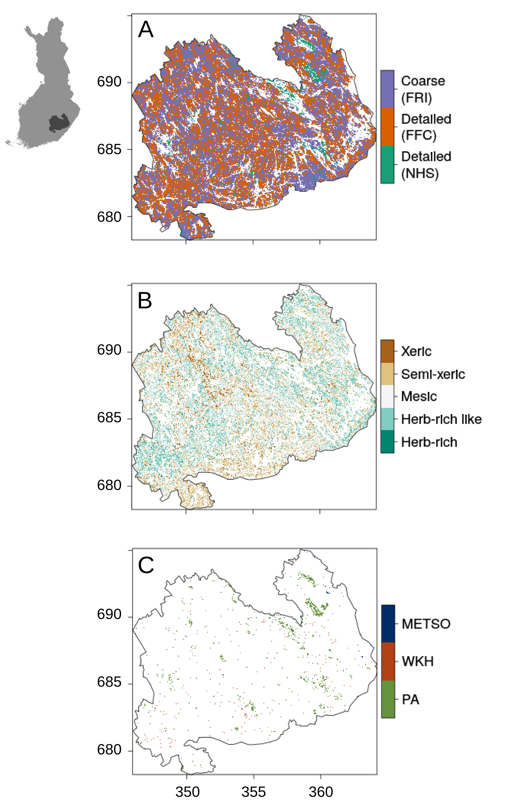
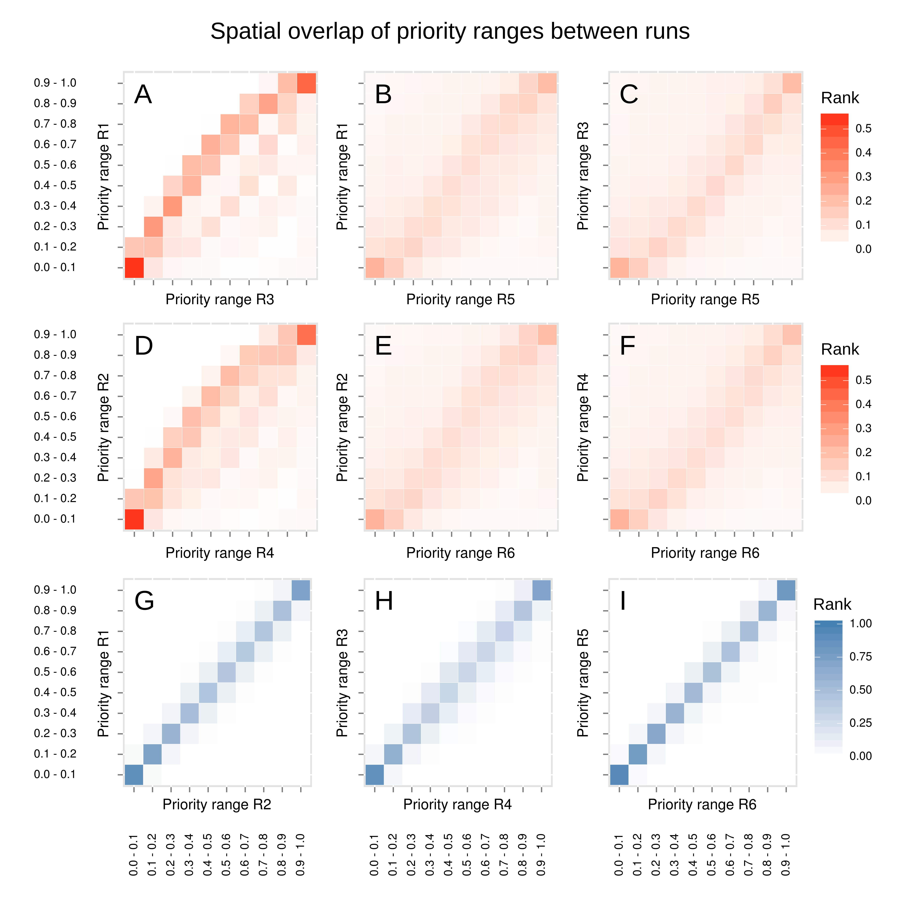

# Figures

__Figure 1.__ Schematics of the prioritization analysis and how the results are analyzed. Figure is divided in three different section: First describes how the index rasters (see XXX for description) from different input data sets were combined. Second sections describes the main characteristics of the spatial conservation prioritization analysis with Zonation. The third section summarizes how the results were analyzed in order to answer the main questions.

__Figure 2.__ Rank priority maps of each variant showing the distribution of different priority classes over the landscape. The marginal plots on top and on the left side of each rank priority map show the count of cells in the top 10% of the overall landscape (i.e. the best 10% of the landscape) along both latitudinal and longitudinal gradient (or rows and columns).Note that the y-scale in each marginal plot (i.e. count) is different. Smaller insets show the priority pattern on a more local scale.

__Figure 3.__ The spatial overlap of priority classes of 10% between different variants as defined by Jaccard coefficient. Rank priority map of each variant is divided into 10 equal interval bins (i.e. 10% priority class) and the spatial coverage is compared to each bin of another variant. Having a value of 1 indicates that the spatial coverages match completely whereas 0 means that there is no overlap. First two rows show comparisons between variants based on different input data sets. Third row shows comparisons between variants based on the same input data set and is thus a comparison between  variants with and without connectivity.

__Figure 4.__ Cost of using coarser data in terms of representation of more detailed data. Solid lines in the figure represent the average occurrence level of biodiversity features overall (panel A) or per soil fertility group (panels B-F). These lines are results of variant 5 (V5). Other lines represent the occurrence levels of the same biodiversity features from variant 5, but when the ranking has been determined by the results of V1 (dotted line) and V3 (dashed line) respectively. By comparing these lines to the solid line compares how much representation of the detailed – and presumably more accurate – data would be lost if the prioritization would be done using coarser data. E.g. for biodiversity feature from soil fertility class “herb-rich” the cost would be ~70%. The same comparison for V2, V4, and V6 resulted in very similar results and is not shown here.

__Figure 5.__ The average priority rank and the distribution of rank priorities of the landscape within the independent spatial validation data. First row corresponds to protected areas, second to woodland key habitats, and the third one to made METSO-deals. Columns show the difference between variants with and without connectivity included. Each of the spatial validation data is assumed to have on average higher conservation value than the surrounding managed forest.

