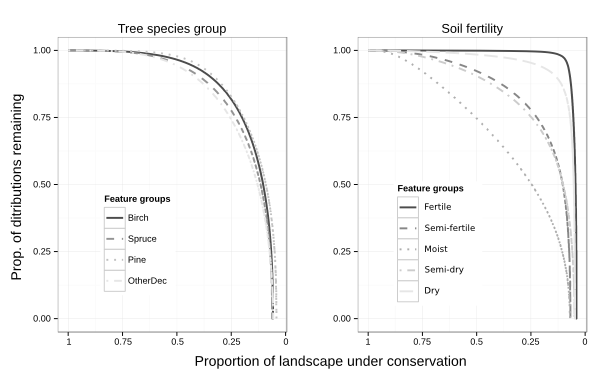

# Figures

__Figure 1.__ Schematics of the analysis setup. Different parts of the analysis were done in different software environments (see text). Analysis feature layers (index layers) were constructed from 3 different data sources (Table 1 and a condition layer (see text) was applied on all of them. Different Zonation analysis variants are indicated by arrows 1-4 (see Table 3) with closed circles indicating the analysis features used. Each analysis variant resulted in a priority maps (Figure 2) and feature-specific performance curves (Figure 3). For validation purposes, each rank priority map was compared to a set of independent validation data to determine the mean and the distribution of ranks (Figure 4).

__Figure 2.__ Conservation rank priority maps. 

  
__Figure 1:__ Schematics of the analysis setup. 

  
__Figure 2:__ Conservation rank priority maps. 

  
__Figure 3:__ Performance curves. 

  
__Figure 4:__ Rank histograms for validation data sets. 