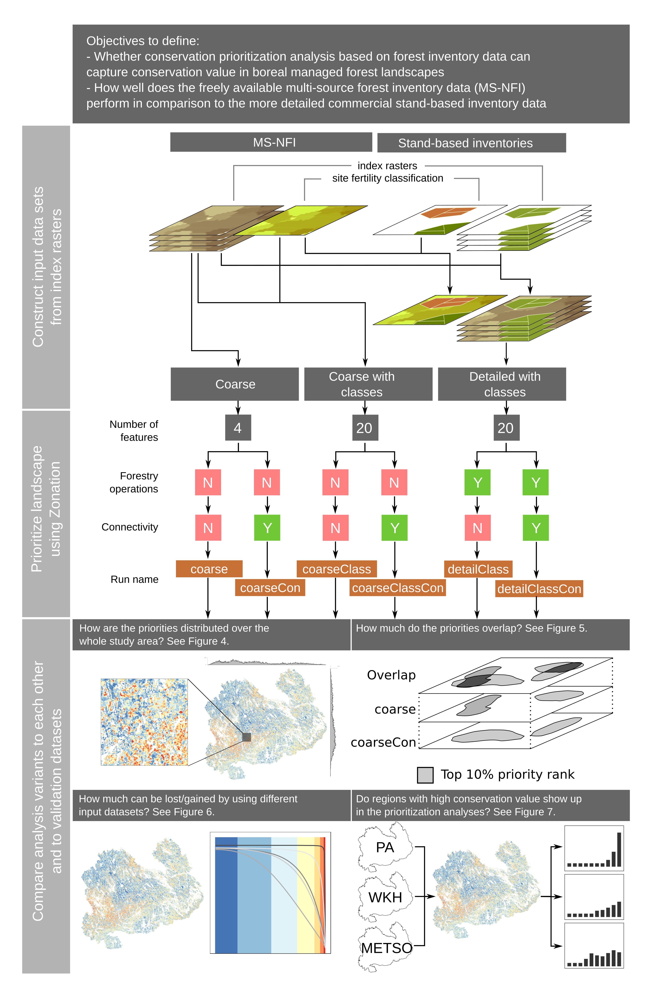
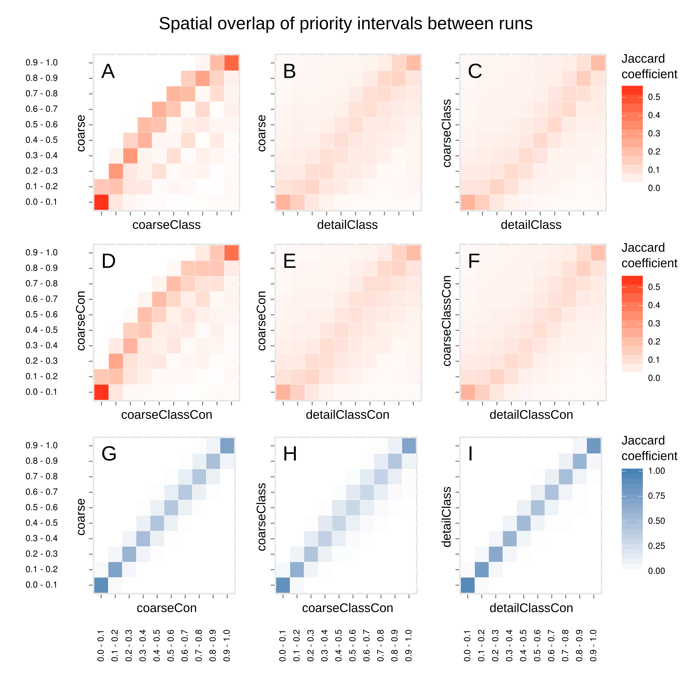

# Figures

__Figure 1.__ Location of Southern Savonia in Finland and Northern Europe. Map in ETRS89 / ETRS-LAEA coordinate reference system.

__Figure 2.__ Schematics of the prioritization analysis and how the results are analyzed. Figure is divided in three different sections: First describes how the index rasters (see 2.5 for description) were combined to produce the input datasets used in the prioritization analysis. Second describes the main characteristics of the spatial conservation prioritization analysis using Zonation. The third section summarizes how the results produced by six different Zonation runs were analyzed.

__Figure 3.__ Rank priority maps showing the distribution of different priority classes over the landscape for runs (Figure2) R1 (A), R2 (B), R3 (C), R4 (D), R5 (E), and R6 (F). The marginal plots on top and on the left side of each rank priority map show the count of cells in the top 10% of the overall landscape (i.e. the best 10% of the landscape) along both latitudinal and longitudinal gradient (or rows and columns).Note that the y-scale in each marginal plot (i.e. count) is different. Smaller insets show the priority pattern on a more local scale.

__Figure 4.__ The spatial overlap of priority classes of 10% between different variants as defined by Jaccard coefficient. Rank priority map of each variant is divided into 10 equal interval bins (i.e. 10% priority class) and the spatial coverage is compared to each bin of another variant. Having a value of 1 indicates that the spatial coverages match completely whereas 0 means that there is no overlap. Panels A-F show comparisons between runs based on different input data sets. Panels G-I show comparisons between runs based on the same input data set with and without connectivity. Note that the scale is different for panels A-F and G-I.

__Figure 5.__ The performance of solution based on coarser data measured by the ability to cover features from detailed data. Curves represent the occurrence levels of biodiversity features from the detailed data over all features (topr right) and per site fertility class. Solid curves are results from R5. Other lines show the occurrence levels of the same biodiversity features from R5, but using the rank order from R1 (dotted line) and R3 (dashed line). The difference between the solid and other curves show how much representation of the detailed – and presumably more accurate – data would be lost or gained if the prioritization is based on coarser data. Same comparison for R2, R4, and R6 resulted in very similar results and is not shown here.

__Figure 6.__ The average priority rank and the distribution of rank priorities of the landscape within the independent spatial validation data. First row corresponds to protected areas, second to woodland key habitats, and the third one to made METSO-deals. Columns show the difference between variants with and without connectivity included. Each of the spatial validation data is assumed to have on average higher conservation value than the surrounding managed forest.

